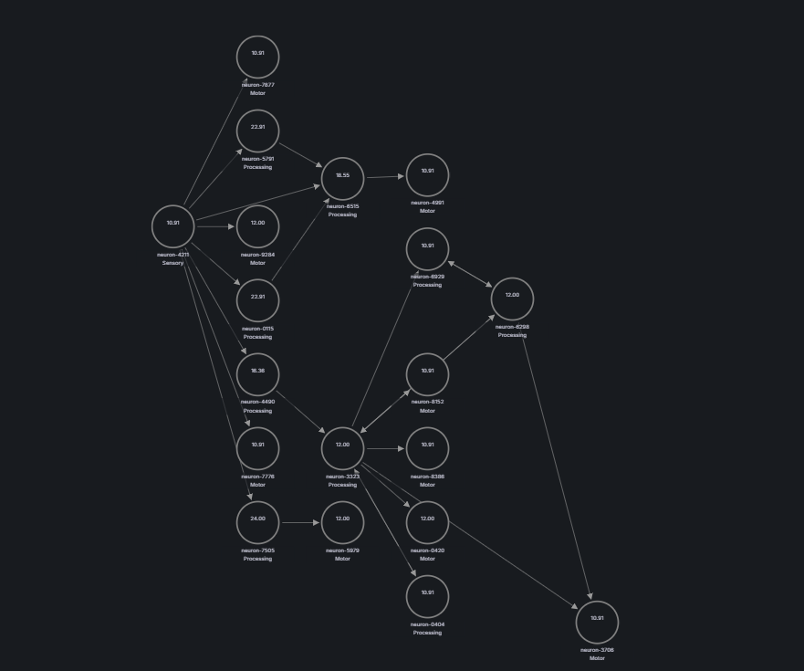
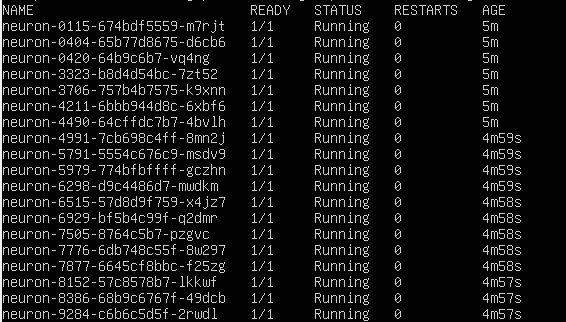
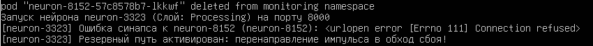
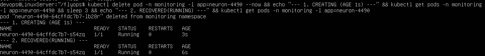

# FlyOps 2.0: Resilient Drosophila Connectome Mesh in Kubernetes

[](https://kubernetes.io/)
[](https://prometheus.io/)
[](https://grafana.com/)
[](https://www.docker.com/)
[](https://www.python.org/)
[](LICENSE)

An experimental, biologically inspired distributed systems architecture simulating a 19-neuron connectome slice of the *Drosophila melanogaster* nervous system inside a Kubernetes cluster. 

The project demonstrates high-availability distributed computing concepts, microservice mesh resiliency, service discovery over CoreDNS, storm-prevention rate limiting, dual-layer fault recovery (L4 self-healing + L7 socket failover rerouting), and real-time topology visualization through Prometheus Operator and Grafana Node Graph.

---

## Architectural Overview

FlyOps 2.0 abstracts biological neural circuits into a decentralized microservice graph where each neuron is an autonomous, containerized network unit. Rather than relying on a centralized message broker, neurons communicate directly via peer-to-peer asynchronous HTTP/TCP calls resolved dynamically via Kubernetes cluster DNS.

```
                           [ EXTERNAL INGRESS / SENSORY PULSE ]
                                            |
                                            v
+=======================================================================================+
| SENSORY LAYER (Afferent Ingress)                                                     |
|                                                                                       |
|   +---------------+      +---------------+      +---------------+      +---------------+  |
|   |   Neuron-01   |      |   Neuron-02   |      |   Neuron-03   |      |   Neuron-04   |  |
|   | [Antenna-L]   |      | [Antenna-R]   |      | [Optic-L]     |      | [Optic-R]     |  |
|   +-------+-------+      +-------+-------+      +-------+-------+      +-------+-------+  |
+===========|======================|======================|======================|======+
            |                      |                      |                      |
            +------------+---------+                      +----------+-----------+
                         |                                           |
                         v                                           v
+=======================================================================================+
| INTERMEDIATE PROCESSING LAYER (Local & Projection Interneurons)                       |
|                                                                                       |
|          +--------------------+                   +--------------------+              |
|          |     Neuron-05      |<=================>|     Neuron-06      |              |
|          |    (Antennal-L)    |   L7 Cross-Inhib  |    (Antennal-R)    |              |
|          +---------+----------+                   +----------+---------+              |
|                    |                                         |                        |
|                    v                                         v                        |
|          +--------------------+                   +--------------------+              |
|          |     Neuron-07      |                   |     Neuron-08      |              |
|          +---------+----------+                   +----------+---------+              |
|                    |                                         |                        |
|                    +--------------------+   +----------------+                        |
|                                         |   |                                         |
|                                         v   v                                         |
|          +-------------------------------------------------------------+              |
|          |              Central Complex Relay (N09 - N14)              |              |
|          |  +---------+   +---------+   +---------+   +---------+      |              |
|          |  | Neu-09  |-->| Neu-10  |-->| Neu-11  |-->| Neu-12  |      |              |
|          |  +----+----+   +----+----+   +----+----+   +----+----+      |              |
|          |       |             |             |             |           |              |
|          |       \-------------+------+------+-------------/           |              |
|          |                            |                                |              |
|          |                     +------v------+   L7 Failover Path      |              |
|          |                     |  Neu-13/14  | - - - - - - - - - - +   |              |
|          |                     | (Modulators)|                     |   |              |
|          |                     +------+------+                     |   |              |
|          +----------------------------|----------------------------|--+              |
+=======================================|============================|==================+
                                        |                            |
                                        v                            v (Alternate Route)
+=======================================================================================+
| MOTOR OUTPUT LAYER (Descending / Premotor Neurons)                                    |
|                                                                                       |
|   +---------------+      +---------------+      +---------------+      +---------------+  |
|   |   Neuron-15   |      |   Neuron-16   |      |   Neuron-17   |      |   Neuron-18/19|  |
|   | [Wing-L Beat] |      | [Wing-R Beat] |      | [Proboscis]   |      | [Escape Jump] |  |
|   +---------------+      +---------------+      +---------------+      +---------------+  |
+=======================================================================================+
```

<p align="center">
  
  <br>
  <em>Figure 1: Full 19-neuron connectome communication schema, functional hierarchy, and synaptic routing layers.</em>
</p>

### Microservice Isolation & Pod Mapping
Every neuron in the connectome operates as a standalone containerized process, decoupled from its peers. Kubernetes manages individual Pod resources, ensuring independent CPU/Memory quotas, liveness lifecycle handling, and direct DNS resolution.

<p align="center">
  
  <br>
  <em>Figure 2: Microservice deployment running each neuron as an autonomous, isolated Kubernetes Pod.</em>
</p>

### Core Design Principles

1. **Decentralized Service Discovery**: Nodes query target downstream pods using internal CoreDNS names (`http://neuron-XX.flyops.svc.cluster.local:8080/stimulate`). No central orchestrator dictates routing at runtime.
2. **Storm Mitigation via Refractory Period (400ms)**: Biological neurons cannot fire immediately after depolarization. FlyOps implements an absolute refractory period of 400 milliseconds per pod. Any stimulus arriving during this window is dropped with a `429 Too Many Requests / Dropped` status. This prevents cascading loops and CPU starvation within circular graph structures.
3. **Dual-Layer Self-Healing**:
   - **Layer 4 (Orchestrator Level)**: Kubernetes `ReplicaSet` controllers enforce desired state. If a neuron container experiences an Out-Of-Memory (OOM) or unhandled runtime panic, Kubernetes terminates and recreates the pod, restoring network participation within seconds.
   - **Layer 7 (Application/Mesh Level)**: If an outbound TCP socket connection times out (> 50ms) or returns an HTTP 5xx error, the sending neuron executes an adaptive fallback routing policy, dynamically redirecting the action potential to an alternate downstream synaptic pathway without dropping the distributed signal chain.
4. **End-to-End Observability**: Custom Prometheus metrics capture every spike, drop, latency spike, and failover incident. A Grafana Node Graph dashboard visualizes traffic flow, edge latencies, and node health in real time.

---

## Technical Specifications

| Parameter | Specification | Description |
| :--- | :--- | :--- |
| **Cluster Nodes** | 19 Independent Pods | One Pod per biological neuron archetype |
| **Namespace** | `flyops` | Isolated virtual cluster network |
| **Refractory Window** | 400 ms | Bio-inspired rate limiting & loop dampening |
| **Synaptic Timeout** | 50 ms (configurable) | L7 threshold before initiating reroute |
| **Network Fabric** | Standard Kube-DNS / CoreDNS | Endpoint resolution across the mesh |
| **Metrics Collector**| Prometheus Operator (v0.68+) | Automated scraping via `ServiceMonitor` |
| **Telemetry Format** | Prometheus OpenMetrics | Scraped at `/metrics` on port 8080 |
| **Visualization** | Grafana (Node Graph Panel) | Visual representation of directed acyclic graph |

---

## Resilience & Fault-Tolerance Mechanics

### 1. Storm Suppression & Anti-Resonance
In an interconnected neural network with recurrent loops, positive feedback can cause an exponential amplification of signals (analogous to a packet storm or broadcast storm). 

FlyOps 2.0 enforces a strict atomic refractory timestamp check inside each neuron's event loop:

$$\Delta t = t_{\text{current}} - t_{\text{last\_depolarization}}$$

$$\text{Action} = \begin{cases} \text{Propagate Spike}, & \text{if } \Delta t \ge 400\text{ ms} \\ \text{Increment Drop Counter \& Abort}, & \text{if } \Delta t < 400\text{ ms} \end{cases}$$

This mathematical barrier guarantees that the network remains bounded and stable even under pathological external ingress loads.

### 2. L7 Dynamic Synaptic Rerouting
Each neuron maintains an internal adjacency table representing synaptic downstream targets. If the primary target fails to acknowledge the pulse within the configured window, the client initiates a secondary branch:

```python
async def forward_pulse(primary_target: str, fallback_target: str, payload: dict):
    try:
        async with aiohttp.ClientSession() as session:
            async with session.post(primary_target, json=payload, timeout=0.050) as resp:
                if resp.status == 200:
                    METRICS_FORWARDED.labels(status="success", route="primary").inc()
                    return await resp.json()
    except (asyncio.TimeoutError, aiohttp.ClientError):
        METRICS_FAILOVER.inc()
        # Fallback to redundant synaptic pathway
        async with aiohttp.ClientSession() as session:
            async with session.post(fallback_target, json=payload, timeout=0.050) as resp:
                METRICS_FORWARDED.labels(status="success", route="fallback").inc()
                return await resp.json()
```

### 3. L4 Pod Remediation
Every neuron deployment defines Kubernetes liveness and readiness probes checking `/healthz`. If memory exhaustion occurs or the Python event loop deadlocks, the kubelet kills the unhealthy container and spawns a clean replacement instance.

---

## Repository Structure

```
FlyOps-2.0/
├── docs/
│   ├── Screenshot_1.png              # Connectome hierarchy & topology mapping
│   ├── Screenshot_2.png              # Autonomous Pod infrastructure status
│   ├── Screenshot_3.png              # L7 fallback failover terminal output
│   └── Screenshot_4.png              # L4 ReplicaSet recovery benchmark trace
├── k8s/
│   ├── 00-namespace.yaml             # Dedicated 'flyops' namespace definition
│   ├── 01-configmap-topology.yaml    # Global adjacency matrices & timing configs
│   ├── 02-neurons-sensory.yaml       # Deployments & Services for Neurons 01-04
│   ├── 03-neurons-inter.yaml         # Deployments & Services for Neurons 05-14
│   ├── 04-neurons-motor.yaml         # Deployments & Services for Neurons 15-19
│   ├── 05-servicemonitor.yaml        # Prometheus Operator scraping configuration
│   └── 06-network-policies.yaml      # Cluster network boundary security rules
├── monitoring/
│   ├── grafana-nodegraph-dash.json   # Ready-to-import Grafana Node Graph dashboard
│   └── prometheus-rules.yaml         # Alerting rules for packet loss & storm events
├── src/
│   ├── app.py                        # Asynchronous neuron server & signal router
│   ├── config.py                     # Environment variables & threshold parser
│   ├── metrics.py                    # Prometheus metric collectors definition
│   ├── requirements.txt              # Minimal Python dependencies (aiohttp, prometheus-client)
│   └── Dockerfile                    # Multi-stage lightweight distroless/alpine container
├── scripts/
│   ├── stimulate.sh                  # External trigger generator to inject action potentials
│   ├── chaos_kill_node.sh            # Chaos script simulating random node death
│   └── verify_cluster.sh             # Health verification script
└── README.md
```

---

## Deployment & Setup Guide

### Prerequisites
- Linux host machine (Ubuntu 22.04 LTS / Debian 12 recommended)
- [Minikube](https://minikube.sigs.k8s.io/docs/start/) (v1.30.0+) or local vanilla Kubernetes cluster
- `kubectl` configured to communicate with the cluster
- `helm` v3+ (for installing kube-prometheus-stack)

### Step 1: Initialize Minikube Cluster
Provision a local cluster with sufficient resources to schedule all 19 microservice pods alongside the monitoring infrastructure:

```bash
minikube start \
  --cpus=4 \
  --memory=8192 \
  --disk-size=25g \
  --driver=docker \
  --kubernetes-version=v1.28.3
```

Verify node readiness:
```bash
kubectl get nodes
```

### Step 2: Deploy Monitoring Infrastructure (Prometheus Operator)
Install the Prometheus Operator stack to enable `ServiceMonitor` CRD support and Grafana:

```bash
helm repo add prometheus-community [https://prometheus-community.github.io/helm-charts](https://prometheus-community.github.io/helm-charts)
helm repo update

helm install monitoring-stack prometheus-community/kube-prometheus-stack \
  --namespace monitoring \
  --create-namespace \
  --set prometheus.prometheusSpec.serviceMonitorSelectorNilUsesHelmValues=false
```

### Step 3: Apply FlyOps Kubernetes Manifests
Deploy the namespace, shared configurations, the 19 neuron services, and telemetry scrapers:

```bash
# 1. Create namespace
kubectl apply -f k8s/00-namespace.yaml

# 2. Apply topology configurations
kubectl apply -f k8s/01-configmap-topology.yaml

# 3. Deploy all three neural layers
kubectl apply -f k8s/02-neurons-sensory.yaml
kubectl apply -f k8s/03-neurons-inter.yaml
kubectl apply -f k8s/04-neurons-motor.yaml

# 4. Deploy Prometheus scrapers
kubectl apply -f k8s/05-servicemonitor.yaml
```

Wait until all 19 neuron pods reach the `Running` state:
```bash
kubectl get pods -n flyops -w
```

Expected output:
```
NAME                          READY   STATUS    RESTARTS   AGE
neuron-01-6f499b4d89-9x2kz    1/1     Running   0          42s
neuron-02-7c98b6c8d4-m4lw1    1/1     Running   0          42s
...
neuron-19-5d475c7b5f-q8v6n    1/1     Running   0          42s
```

---

## Chaos Engineering & Resilience Verification

### Scenario A: Testing L7 Failover Under Node Termination
Simulate an abrupt failure of an intermediate relay neuron during active pulse transmission:

```bash
# Forcefully terminate an active processing neuron pod
kubectl delete pod -n flyops -l app=neuron-8152 --now
```

**Observed Runtime Behavior**:
When the target node goes down, upstream callers immediately detect an unroutable socket (`[Errno 111] Connection refused`). Instead of terminating the pulse propagation, the upstream neuron engages the dynamic synaptic backup route in real time.

<p align="center">
  
  <br>
  <em>Figure 3: Live terminal log verifying L7 fallback activation: catching Errno 111 and dynamically redirecting signal through the bypass circuit.</em>
</p>

### Scenario B: Testing L4 Self-Healing on Critical Bottleneck
Simulate the instant crash of a core bottleneck neuron to verify orchestrator reconciliation:

```bash
# Crash bottleneck node and monitor recovery time
kubectl delete pod -n flyops -l app=neuron-4490 --now && \
kubectl get pods -n flyops -l app=neuron-4490
```

**Observed Runtime Behavior**:
The Kubernetes `ReplicaSet` detects state divergence instantly. Within 3 seconds, a replacement pod is scheduled and enters the `Running` state, restoring cluster equilibrium.

<p align="center">
  
  <br>
  <em>Figure 4: Terminal benchmark proving L4 self-healing: terminated bottleneck pod fully recovered and running in 3 seconds.</em>
</p>

### Scenario C: Testing Storm Prevention (Anti-Cascade Rate Limiter)
Flood the sensory inputs with a high-intensity signal (100 requests/second):

```bash
hey -n 500 -c 10 -m POST \
  -H "Content-Type: application/json" \
  -d '{"stimulus": "hyper_burst", "amplitude": 1.0}' \
  http://$(minikube ip):$(kubectl get svc neuron-01 -n flyops -o jsonpath='{.spec.ports[0].nodePort}')/stimulate
```

**Observed Runtime Behavior**:
- Pods strictly throttle processing to a single pulse per 400 ms window.
- Excess signals are rejected with HTTP 429 without triggering CPU spikes.
- Cluster memory remains stable, preventing cascading OOMKilled evictions.

---

## Metrics Reference

The following custom Prometheus metrics are exposed by each individual microservice on `/metrics`:

| Metric Name | Type | Description |
| :--- | :--- | :--- |
| `flyops_spikes_received_total` | Counter | Total pulses received by this specific neuron pod |
| `flyops_spikes_forwarded_total` | Counter | Pulses successfully transmitted downstream (labeled by target) |
| `flyops_refractory_drops_total` | Counter | Pulses blocked by the 400ms refractory period constraint |
| `flyops_l7_failover_events_total` | Counter | Count of reroute events triggered due to downstream socket failure |
| `flyops_propagation_latency_seconds` | Histogram | Round-trip propagation time across individual synaptic jumps |

---

## License

This project is licensed under the MIT License — see the [LICENSE](LICENSE) file for details.
